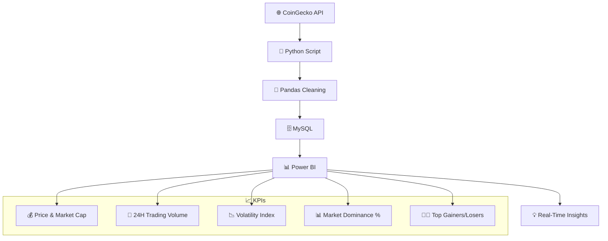

# 🚀 Cryptocurrency Market Intelligence Dashboard

---

## 📌 Project Summary

**Track real-time cryptocurrency trends, volatility, dominance, and top movers using Python, MySQL, and Power BI.**  
This dashboard gives crypto traders and investors a live view of critical metrics pulled directly from the CoinGecko API.

---

## 🎯 Business Problem

Cryptocurrency markets are volatile, open 24/7, and hard to track. Investors struggle with scattered tools and outdated data.  
This project solves that by delivering a **centralized, real-time dashboard** covering:

- ✅ Market prices & cap
- ✅ 24H trading volume
- ✅ Price volatility
- ✅ Coin dominance
- ✅ Top gainers & losers

---

## 🔍 Key Features

- 💰 Real-time price and market cap for top 20 coins  
- 🔄 24H trading volume for liquidity tracking  
- 📉 Volatility index over the last 24 hours  
- 📊 Market dominance share by coin  
- 🔺🔻 Top gainers and losers leaderboard  
- 🎯 Interactive filters by coin, rank, and category

---

## 🛠 Tech Stack

- **Language:** Python  
- **Libraries:** `requests`, `pandas`  
- **Database:** MySQL  
- **API Source:** [CoinGecko API](https://www.coingecko.com/en/api)  
- **Visualization:** Power BI  
- **File Format:** `.pbix` Power BI dashboard

---

## 🧠 Architecture

## 📊 KPIs Tracked

- Real-Time Price & Market Cap  
- 24H Trading Volume  
- Price Volatility Index (24H)  
- Market Dominance by Coin  
- Top Gainers & Losers (24H)

## 📸 Dashboard Preview

## 🚧 Challenges & Learnings
API rate limits from CoinGecko

Parsing and transforming nested JSON

DAX formula creation in Power BI

Real-time refresh and scheduling logic

## 🚀 Future Enhancements
🔔 Price alerts & signal triggers

🧠 Social sentiment (Reddit/Twitter) integration

📈 ML-based price prediction

💼 User portfolio tracking features

## 👨‍💻 About Me
Hi, I'm B. Sunil Kumar Reddy, a Data Analyst who builds real-world dashboards from real-world data.
Focused on APIs, automation, and business value through analytics.

🔗 LinkedIn Profile(https://www.linkedin.com/in/sunilreddy-data-analyst/)

💻 Explore More Projects(https://github.com/Sunil5411)

## ⭐ Support
If you found this project helpful, feel free to give it a ⭐ — it motivates me to keep building and sharing more real-world analytics projects.
